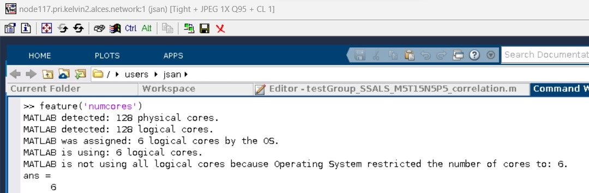
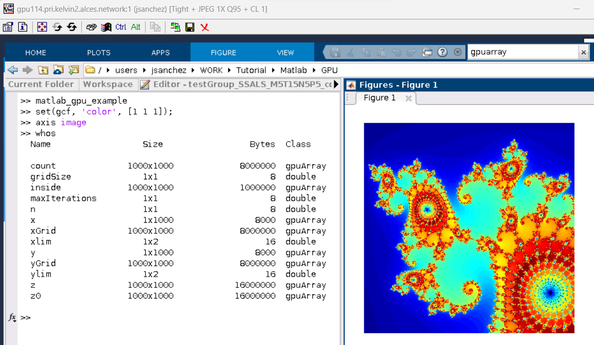
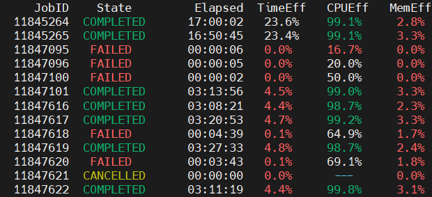

# Application Guides

Here we will provide information on some of the most popular centrally installed applications and software tools on Kelvin2.

## **Abaqus**

[https://www.technia.com/software/simulia/abaqus](https://www.technia.com/software/simulia/abaqus){target=_blank}

"The best suite of non-linear Finite Element Analysis (FEA) and Computational Fluid Dynamics (CFD) solvers."

### Installed versions
```bash
   abaqus/2023
   abaqus/2024
```

### Usage notes

??? note "Licensing"

    Simulia Abaqus is a licensed software. In order to use it, users have to be registered in the license server. If you are not already included in the license server, you must contact the person in charge of it:

    QUB: John Megahey [smae-ithelp@qub.ac.uk](mailto:smae-ithelp@qub.ac.uk)

    Ulster: [Jose Sanchez Bornot](mailto:jm.sanchez-bornot@ulster.ac.uk)

    When the module is loaded, no license parameters are loaded. They should be added manually.

    To run Abaqus, it is necessary to create an environment file

    ```bash
       abaqus_v6.env
    ```

    with all the necessary parameters. This file is particular to the user.

    To activate the license, the following lines should be added at the end of the environment file:

    ```bash
       LICENSE_SERVER_TYPE=flex
       FLEX_LICENSE_CONFIG=<port>@<server>
       ACADEMIC_TYPE=research
    ```

    Contact the license administrators to get the information on the port and server.

??? note "User Manual" 

    Visit the Simulia [Abaqus](https://www.3ds.com/products/simulia/abaqus){target=_blank} web page to have access to the help material.

    And the community [forum](https://eu1.iam.3dexperience.3ds.com/login){target=_blank}.

### Usage examples

??? example "Abaqus batch script example"

    ```bash
       #!/bin/bash

       #SBATCH --job-name=Cunha_LVI_DD_An_74J_Shell_R
       #SBATCH --ntasks=20
       #SBATCH --partition=k2-medpri
       #SBATCH --nodes=1
       #SBATCH --mem-per-cpu=12G
       #SBATCH --time=23:59:00
       #SBATCH --output=std_output_%j
       #SBATCH --mail-user=<myemail>@qub.ac.uk
       #SBATCH --mail-type=BEGIN,END,FAIL

       module load abaqus/2024

       unset SLURM_GTIDS
       abaqus analysis cpus=20 job=Cunha_LVI_DD_An_74J_Shell_R double=BOTH mp_mode=mpi int

       echo "here"
       pwd
    ```


## **Anaconda** 

[https://www.anaconda.com/](https://www.anaconda.com/){target=_blank}

Anaconda is a software that allows the users to manage environments to install local libraries and software, particularly Python and R programming languages, for scientific computing. Thus, greatly easing software management and reducing possible incompatibilities among different tools, libraries or software versions.

### Installed versions

``` bash title="Anaconda modules"
apps/anaconda3/2024.06/bin
apps/anaconda3/2024.10/bin
```

### Usage notes

??? note "Setting up the environment variables"

    When the particular module for Anaconda is loaded, some environment variables must be set up in the system to make it work properly.

    ``` bash title="Language variables"
    export LANGUAGE=en_US.UTF-8
    export LANG=en_US.UTF-8
    export LC_ALL=en_US.UTF-8
    ```

    The Anaconda distributions come with a generic environment script.
    This script should be loaded in the environment of the user to allow all conda features, for example activating and deactivating conda environments.
    These environment scripts are specific to the conda version, and if an environment script is loaded for a different conda version than the one loaded in the module,
    it will fall into incompatibilities and will make the conda applications installed not to work.

    To load the environment scripts, it is done in `bash` and `ksh` shells preceding the name of the script with the special character dot `.`,
    or in csh with the key word `source`.

    The path to these environment scripts are
    ```
    <Anaconda_root>/bin/etc/profile.d/conda.sh
    ```

    For example, in the case of the module for the version 2024.10 of Anaconda:

    ``` bash title="bash, ksh"
    . /opt/gridware/depots/54e7fb3c/el8/pkg/apps/anaconda3/2024.10/bin/etc/profile.d/conda.sh
    ```
    ``` bash title="csh"
    source /opt/gridware/depots/54e7fb3c/el8/pkg/apps/anaconda3/2024.10/bin/etc/profile.d/conda.sh
    ```

    For users who are going to work with Anaconda in a regular basis, it is a good practice to include the definition of the language variables and
    the call to the environment script in the start-up script
    ```
    ~/.bashrc
    ```
    In this case, keep in mind to modify this line in your `.bashrc` script if you change the Anaconda version for your work.

??? note "Redirecting default installation paths to Scratch directory"

    When installing packages with Anaconda, it is recommended that users redirect the default installation paths to their Scratch directory. 
    This is because the installations typically generate a very large number of small files which can breach the 100k file limit in place on the Home directory. 
    This can be done by modifying the environment variables `CONDA_PKGS_DIRS` and `CONDA_ENVS_PATH` as follows:

    ``` bash
    mkdir /mnt/scratch2/users/$USER/conda
    export CONDA_PKGS_DIRS=/mnt/scratch2/users/$USER/conda/pkgs
    export CONDA_ENVS_PATH=/mnt/scratch2/users/$USER/conda/envs
    ```

??? note "Selecting the correct hardware prior to installation"

    When installing packages with Anaconda, it is critical to perform the installation on a node with the appropriate hardware in place. 
    For example, if you intend to run your code using a GPU device, but install that code (or its dependencies) using a node without one, the GPU device may not being recognised at runtime.  
    This may result in your program crashing, or instead run in the CPU cores by default. 
    In the latter case, your jobs may take significantly longer to complete and also would also cause the requested GPU resources to be sitting idle and unavailable to other users.


??? note "Complexities in installing packages with Python and Anaconda"

    When installing packages with both Python and Anaconda, there may be complexities related to package version incompatibilities, 
    the proper Python version (maybe an older or newer version is strictly required), package installation order, or the possible necessity to install supporting libraries. 
    The first three "Usage examples" below demonstrate the installation of some commonly used applications.

### Usage examples

??? example "Installing PyTorch and Ray Tune"

    In this example, PyTorch is installed together with Ray Tune. 
    The latter is a tool used for deep learning models optimization as it helps with the evaluation and selection of model hyperparameters 
    (e.g., number of layers, neurons per layer, selection between different transfer or optimization functions, etc.)

    ``` bash title="Pytorch-Raytune install" linenums="1"
    srun -p k2-gpu-interactive -N 1 -n 1 --gres gpu:1g.10gb:1 --time=3:00:00 --mem=20G --pty bash
    module load apps/anaconda3/2024.06/bin
    module load libs/nvidia-cuda/11.8.0/bin
    . /opt/gridware/depots/54e7fb3c/el8/pkg/apps/anaconda3/2024.06/bin/etc/profile.d/conda.sh
    conda create --name py39torchRayA100 python=3.9
    conda activate py39torchRayA100
    (py39torchRayA100) conda install pytorch torchvision torchaudio pytorch-cuda=11.8 -c pytorch -c nvidia
    (py39torchRayA100) python3
    (py39torchRayA100) conda install pytorch-lightning -c conda-forge
    (py39torchRayA100) conda install -c conda-forge "ray-air"
    (py39torchRayA100) conda deactivate
    ```

    Line 1 above shows the use of GPU slice partitions: `--gres gpu:1g.10gb:1`. 
    As currently there are available 28 slices in Kelvin2, this partition is much less busy than the other GPU partitions, 
    and at the same time would allow the users to install software in the A100 GPU devices, which would guarantee backward compatibility with GPU devices.

    Lines 2-5 setup the environment variables, create an Anaconda environment named `py39torchRayA100` while installing Python version 3.9, and activate the environment. 
    This Python version is strictly required here as current Ray Tune installation version may crash with newer Python versions than 3.10.

    The next lines 6-10 are needed to install the required tools, particularly Ray Tune is installed in line 9. 
    Here, the package "ray-air" contains most of the provided functionality by Ray Tune (Data, Train, Tune, Serve, etc.).

    After installation, users must check that PyTorch can correctly utilize the GPU resources available. 
    For example, users must see something similar to the following output when running the PyTorch's functions:

    ``` bash title="Testing that torch can see GPU resources"
    conda activate py39torchRayA100
    (py39torchRayA100) python3
    >>> import torch
    >>> torch.cuda.is_available()
    True
    >>> torch.cuda.current_device()
    0
    >>> torch.cuda.device(0)
    <torch.cuda.device object at 0x7fec6d471850>
    >>> torch.cuda.get_device_name(0)
    'NVIDIA A100-SXM4-80GB MIG 1g.10gb'
    >>> exit()
    (py39torchRayA100) conda deactivate
    ```


??? example "Installing tensorflow-gpu and Ray Tune"

    For installing tensorflow-gpu and Ray Tune, follow these instructions:

    ``` bash title="Tensorflow-Raytune install" linenums="1"
    srun -p k2-gpu-interactive -N 1 -n 1 --gres gpu:1g.10gb:1 --time=3:00:00 --mem=20G --pty bash
    module load apps/anaconda3/2024.06/bin
    module load libs/nvidia-cuda/11.8.0/bin
    . /opt/gridware/depots/54e7fb3c/el8/pkg/apps/anaconda3/2024.06/bin/etc/profile.d/conda.sh
    conda create --name tensorflowRayA100 python=3.9
    conda activate tensorflowRayA100
    (tensorflowRayA100) conda install -c anaconda tensorflow-gpu
    (tensorflowRayA100) conda install -c conda-forge "ray-air"
    (tensorflowRayA100) conda deactivate
    ```

    Users also must test that tensorflow can correctly see the GPU resources. For that purpose, after installing the software, use the following commands:

    ``` bash title="Testing that tensorflow can see GPU resources"
    conda activate tensorflowRayA100
    (tensorflowRayA100) python3 -c "import tensorflow as tf; print(tf.config.list_physical_devices('GPU'))"
    (tensorflowRayA100) conda deactivate
    ```

??? example "Installing and using Bindsnet"

    In this example, users can overview how to install Bindsnet in Kelvin2:

    ``` bash title="Bindsnet install" linenums="1"
    srun -p k2-gpu-interactive -N 1 -n 1 --gres gpu:1g.10gb:1 --time=3:00:00 --mem=20G --pty bash
    module load apps/anaconda3/2024.06/bin
    . /opt/gridware/depots/54e7fb3c/el8/pkg/apps/anaconda3/2024.06/bin/etc/profile.d/conda.sh
    conda create --name bindsnet
    export PATH=/mnt/scratch2/users/$USER/conda/envs/bindsnet/bin/:$PATH
    conda activate bindsnet
    (bindsnet) conda install python=3.10
    (bindsnet) python3 -m pip install git+https://github.com/BindsNET/bindsnet.git
    (bindsnet) python3 -m pip show bindsnet
    (bindsnet) python3 -m pip install pytest
    (bindsnet) conda deactivate
    ```

    The apparent simplicity of above instructions hides some complexities. 
    For example, the declaration of the "PATH" environment variable in line 4 may be neccesary when PyPi/pip is combined with Anaconda, 
    as some of the installed packages may still be missing after installation, unexpectedly. 
    Also, in line 6, Python's version 3.10 was installed as Bindsnet most recent version at this moment seems not to be compatible with older Python versions.

    Finally, when installing Bindsnet in line 7, it automatically finds and installs all needed dependencies, including the compatible versions for torch, torchvision, etc. 
    Therefore, we do not recommend to install any package before bindsnet, otherwise bindsnet installation can fail. 
    Then, in line 8, the command `python3 -m pip show bindsnet` allows to get the physical path where Bindsnet is installed, which may be necessary to access some folders with testing examples and scripts. 
    For the same reasons, users may want to install the package "pytest", as it is done in line 9.

    As Bindsnet will install automatically PyTorch as one of its dependencies, we strongly recommend to test that PyTorch can see the GPU resources, as discussed in the Installing Pytorch and Ray Tune example.

    The following is an example of sbatch script that uses the installed Bindsnet package, which can be launched from command line using the command `sbatch bindsnet_example.sh`. 
    Of course, users must have first to prepare their python codes, with the main file name provided in line 19. 

    ``` bash title="bindsnet_example.sh" linenums="1"
    #!/bin/bash
    #SBATCH --job-name=nnet
    #SBATCH -N 1
    #SBATCH -n 4
    #SBATCH --mem=40G
    #SBATCH --partition=k2-gpu
    #SBATCH --gres gpu:v100:1
    ##SBATCH --gres gpu:a100:1
    #SBATCH --time=03:00:00
    #SBATCH --output=nnet_%j.log

    module load apps/anaconda3/2024.06/bin
    . /opt/gridware/depots/54e7fb3c/el8/pkg/apps/anaconda3/2024.06/bin/etc/profile.d/conda.sh
    export CONDA_PKGS_DIRS=/mnt/scratch2/users/$USER/conda/pkgs
    export CONDA_ENVS_PATH=/mnt/scratch2/users/$USER/conda/envs
    export PATH=/mnt/scratch2/users/$USER/conda/envs/bindsnet/bin/:$PATH

    conda activate /mnt/scratch2/users/$USER/conda/envs/bindsnet

    python3 <code_file_name>.py
    ```


??? example "Installing R Packages (e.g. HOMER) with Anaconda"

    To create an environment on the user's scratch folder to install a particular version of R, follow these instructions:

    ``` bash title="R installation in an Anaconda environment" linenums="1"
    srun -p k2-hipri -N 1 -n 4 --time=3:00:00 --mem=16G --pty bash
    module load apps/anaconda3/2024.06/bin
    . /opt/gridware/depots/54e7fb3c/el8/pkg/apps/anaconda3/2024.06/bin/etc/profile.d/conda.sh
    export CONDA_PKGS_DIRS=/mnt/scratch2/users/$USER/conda/pkgs
    export CONDA_ENVS_PATH=/mnt/scratch2/users/$USER/conda/envs
    conda create -n R412env -c conda-forge r-base=4.1.2
    ```

    Here, the preferred version (4.1.2) is specified in line 5 with the argument "r-base=4.1.2". 
    For other versions, check the Anaconda R's online documentation, for example [here](https://anaconda.org/conda-forge/r-base){target=_blank} 
    or [here](https://docs.anaconda.com/free/anaconda/packages/using-r-language/){target=_blank} for more information.

    **Installation Example: HOMER**

    The following example illustrates how to use this environment for installing a particular R's package 
    [HOMER](http://homer.ucsd.edu/homer/introduction/install.html){target=_blank}, proceeding from a clean/new Kelvin2 terminal connection.

    ``` bash
    srun -p k2-hipri -N 1 -n 4 --time=3:00:00 --mem=16G --pty bash
    module load apps/anaconda3/2024.06/bin
    . /opt/gridware/depots/54e7fb3c/el8/pkg/apps/anaconda3/2024.06/bin/etc/profile.d/conda.sh
    export CONDA_PKGS_DIRS=/mnt/scratch2/users/$USER/conda/pkgs
    export CONDA_ENVS_PATH=/mnt/scratch2/users/$USER/conda/envs
    conda activate R412env
    (R412env)$ conda config --add channels defaults
    (R412env)$ conda config --add channels bioconda
    (R412env)$ conda config --add channels conda-forge
    (R412env)$ conda install -c bioconda samtools r-essentials bioconductor-deseq2 bioconductor-edger
    (R412env)$ conda install homer
    (R412env)$ conda update homer
    (R412env) conda deactivate
    ```

    Users should notice that when working with R inside an Anaconda environment, the libraries must be installed with the command `conda install ...`. Whereas, the packages can be installed either in the same way by using conda install, or from the R's command line; for instance, using the function `installed.packages()`. 

??? example "Jupyter Notebook with TensorFlow in Anaconda"

    Here, we present instructions to install and use Jupyter notebook in Kelvin2, in the case for training deep learning networks with tensorflow-gpu.

    ``` bash title="Jupyter notebook installation" linenums="1"
    srun -p k2-gpu-interactive -N 1 -n 4 --gres gpu:1g.10gb:1 --time=3:00:00 --mem=20G --pty bash
    #srun -p k2-hipri -N 1 -n 4 --time=3:00:00 --mem=16G --pty bash
    module load apps/anaconda3/2024.06/bin
    . /opt/gridware/depots/54e7fb3c/el8/pkg/apps/anaconda3/2024.06/bin/etc/profile.d/conda.sh
    conda create -n tf-gpu tensorflow-gpu numpy=1.19.2
    # export PATH=/mnt/scratch2/users/$USER/conda/envs/tf-gpu/bin/:$PATH
    conda activate tf-gpu
    (tf-gpu) conda install -c anaconda jupyter
    (tf-gpu) conda deactivate
    ```

    If the user does not need to use GPU resources, for example, the plan is to run on CPU cores, then `srun` instruction in line 2 must be used, instead of line 1, 
    to get an interactive session in CPU nodes for the installation. 
    Also, ignore the installation of tensorflow part if the only purpose is to install Jupyter notebook to be used with other packages, such as Pandas or NumPy. 
    In that case, just create the environment in line 4 with the following instruction: `conda create -n <environment_name>`.

    Finally, to access Jupyter notebook remotely from the (local) browser in the user's PC/laptop, the user must launch a Jupyter server connection and create a tunnel to it. 
    To launch the server, run these commands:

    ``` bash linenums="1"
    srun -p k2-gpu-interactive -N 1 -n 4 --gres gpu:1g.10gb:1 --time=3:00:00 --mem=20G --pty bash
    #srun -p k2-hipri -N 1 -n 4 --time=3:00:00 --mem=16G --pty bash
    module load apps/anaconda3/2024.06/bin
    . /opt/gridware/depots/54e7fb3c/el8/pkg/apps/anaconda3/2024.06/bin/etc/profile.d/conda.sh
    conda activate tf-gpu
    (tf-gpu) jupyter notebook --ip $(ip addr show eno1 | grep 'inet ' | awk '{print $2}' | cut -d/ -f1) --no-browser
    ```

    Jupyter notebook has to run in a compute node. That is why first need to allocate a compute node with `srun` command as shown in line 1 or 2 for a GPU or CPU node. 
    Here, the server is lauched in line 5. Some critical output is printer, mainly the IP and port number, which should be annotated for using later to create the tunnel.

    For the last part, open a local terminal in the user's PC/laptop, and enter the following instructions:

    ```bash
    ssh -p 55890 -i /path/to/kelvin/key <user_name>@login.kelvin.alces.network -NL 8888:10.10.15.3:8888
    ```

    This establishes the tunnel using `ssh` command, where it has been assumed that the IP and port number annotated above are "10.10.15.3" and "8888", respectively.

    If not errors are reported during the execution of these commands, and the terminal looks like hanging out, then everything is ok, 
    and the last step is to open a local browser and enter the adress "http://127.0.0.1 ...", which must have been shown in the output when the server connection was created.


## **Ansys**

[https://www.ansys.com](https://www.ansys.com){target=_blank}

"For more than 50 years, Ansys software has enabled innovators across industries to push boundaries with the predictive power of simulation. From sustainable transportation and advanced semiconductors, to satellite systems and life-saving medical devices, the next great leaps in human advancement will be powered by Ansys." - [Ansys Company Information](https://www.ansys.com/en-gb/company-information){target=_blank}

### Installed versions
```bash
  ansys/v231/qub
  ansys/v231/ulster
  ansys/v241/qub
  ansys/v241/ulster
  ansys/v242/qub
  ansys/v242/ulster
  ansys/v251/qub
  ansys/v251/ulster
```

### Usage notes

??? note "Licensing"

    Ansys is a licensed software. In order to use it, users have to be registered in the license server. If you are not already included in the license server, you must contact the person in charge of it:

    QUB: John Megahey [smae-ithelp@qub.ac.uk](mailto:smae-ithelp@qub.ac.uk)

    Ulster: [Jose Sanchez Bornot](mailto:jm.sanchez-bornot@ulster.ac.uk)

    When the module is loaded, the suffixes "qub" and "ulster" specify which license-server parameters are uploaded.
    Users have read permission exclusively to the module file associated to their university, both have campus licence.
    Contact the license administrator for details.

??? note "User Manual" 

    The user manual for Ansys is not publicly available, and only licensed users can access to it. To access to this material, you must [register on the Ansys website](https://customercenter.ansys.com){target=_blank}.

### Usage examples

??? example "Ansys Fluent batch script example"

    ```bash
    #!/bin/bash

    #SBATCH --job-name=myfluentjob
    #SBATCH --output=myoutput.out
    #SBATCH --error=myerror.err
    #SBATCH --nodes=1
    #SBATCH --ntasks=32
    #SBATCH --partition=k2-hipri
    #SBATCH --mem=100G

    module load ansys/v241

    ## QUB's license, already loaded with the module
    #export ANSYSLI_SERVERS=2325@143.117.212.118
    #export ANSYSLMD_LICENSE_FILE=1055@143.117.212.118

    ## Ulster's license
    #export ANSYSLI_SERVERS=2325@193.61.145.219
    #export ANSYSLMD_LICENSE_FILE=1055@193.61.145.219

    # Set architecture of the CPU (in this case amd64) and environment variables
    export FLUENT_ARCH=lnamd64
    export FL_TMPDIR=$SCRATCH/tmp

    # Create our hosts file 
    srun hostname -s | sort > hosts.$SLURM_JOB_ID.txt

    #Run Ansys Fluent.
    fluent 3ddp -g -t$SLURM_NTASKS -pinfiniband -mpi=openmpi -cnf=hosts.$SLURM_JOB_ID.txt -i my_fluent_input > my_fluent_output.res
    ```

## **MATLAB**

[https://uk.mathworks.com/products/matlab.html](https://uk.mathworks.com/products/matlab.html){target=_blank}

"MATLAB is a programming platform designed specifically for engineers and scientists to analyze and design systems and products that transform our world. The heart of MATLAB is the MATLAB language, a matrix-based language allowing the most natural expression of computational mathematics." - [What is MATLAB?](https://www.mathworks.com/discovery/what-is-matlab.html){target=_blank}

### Installed versions

```bash
   matlab/R2019a
   matlab/R2020b
   matlab/R2022a
   matlab/R2024a
```

### Usage examples

??? example "Interactive mode (CLI) on a CPU compute node"

    One way to run MATLAB interactively is to request a compute node with the `srun` command. For example, request 1 compute node and 10 cores in "k2-hipri" partition:

    ``` bash
    srun -p k2-hipri -N 1 -n 10 --mem=10G --time=1:00:00 --pty bash
    module load matlab/R2024a
    matlab -nosplash -nodisplay
    ```

    Then, inside MATLAB, notice that calling the function `feature` (line #1 below) must show that exactly 10 CPU cores are available, corresponding to the number of cores allocated above with the `srun` command. Next, the codes launches the parallel pool (`parpool`) for the "local" cluster requesting the same amount of workers as the cores allocated in this example.

    ``` matlab
    feature('numcores')
    p = parpool('local', 10) % 10 cores requested in this example
    ```

    More robust, the number of workers can be read and set automatically to launch the parallel pool:

    ``` matlab
    num_workers = str2double(getenv('SLURM_CPUS_ON_NODE'))
    p = parpool('local', num_workers)
    ```

    Finally, you can run your MATLAB parallel code, which must include a "parfor" loop. For example, the following code illustrates the use of `parfor` and Monte Carlo simulation to calculate an approximate value for \( \pi \), using the formula (line #7):

    $$
    \pi \approx \lim_{N_{MC} \to \infty} {4 \sum_{n=1}^{N_{MC}} I(x_i^2 + y_i^2 < 1.0) \over N_{MC}}; x_i, y_i \sim \mathcal{U}(0,1),
    $$

    where the symbol \( \mathcal{U}(0,1) \) represents the random uniform distribution for the indicated interval and \( I(boolean) \) is an indicator function.

    ``` matlab title="Matlab code for parfor demonstration" linenums="1"
    N = 1e6;
    out = zeros(1, num_workers);
    parfor i = 1:num_workers
        xy = rand(N,2);
        out(i) = sum(sum(xy.^2,2)<=1);
    end
    mypi = 4*sum(out)/(N*num_workers)
    ```

    At the end of the parallel computations, the allocated parpool within MATLAB can be released with the following command:

    ``` matlab
    delete(gcp('nocreate'))
    ```


??? example "Interactive mode (GUI) on a CPU compute node"

    First, get a compute node and launch vnc server from the node, for example:

    ``` bash
    srun -p k2-hipri -N 1 -n 6 --mem=10G --time=1:00:00 --pty bash
    vncserver
    ```

    In this case, let us assume that the output of `vncserver` is

    *New 'node117.pri.kelvin2.alces.network:1 (jsan)' desktop is node117.pri.kelvin2.alces.network:1*

    *Starting applications specified in /users/jsan/.vnc/xstartup*<br>
    *Log file is /users/jsan/.vnc/node117.pri.kelvin2.alces.network:1.log*

    Then, open a local terminal and launch a forward tunnel to the compute node by following these steps:

    1. Go to the directory which contains the Kelvin key in your PC/laptop
    ``` bash	
    cd /drives/c/Users/jsan/.ssh
    ```
    2. Create the tunnel (in this example illustrated with the command below, all input sent via port *5903* on your local host is being forwarded via port *5901* to the compute node *"node117.pri.kelvin2.alces.network"*. If the `vncserver` output above were *"node117.pri.kelvin2.alces.network:7"*, then the port number will be *5907* instead of *5901*. Clearly, users must replace the username *"jsan"* and the key's filename by the corresponding information for their accounts)
    ``` bash	
    ssh -L 5903:node117.pri.kelvin2.alces.network:5901 -p 55890 -i ./kelvin-key jsan@login.kelvin.alces.network
    ```
    3. Connect to the tunnel using your installed VNC application (the example shown in the figure below uses TurboVNC in Windows OS. More details or troubleshooting can be found in the VNC session)
    
    4. Once in the opened terminal for the connected compute node, launch the MATLAB application:
    ```bash
    module load matlab/R2024a
    matlab
    ```

    This time MATLAB GUI will be opened as shown in the figure below. For a better experience, use the "full screen" button in the VNC toolbar, and use the combination keys ++ctrl+alt+shift++ + F to escape from the full screen mode. Note also that using the instruction `feature('numcores')` inside the MATLAB GUI session shows correctly the number of allocated CPU cores in the compute node (CPU cores equal to 6 in this example).

    { width="800" }


??? example "MATLAB script used in following GPU examples"

    The following code `matlab_gpu_example.m` is to be used in the following GPU examples

    ``` matlab title="matlab_gpu_example.m" linenums="1"
    % The Mandelbrot algorithm iterates over a grid of real and imaginary parts.
    % The following code defines the number of iterations, grid size, and grid limits.
    maxIterations = 500;
    gridSize = 1000;
    xlim = [-0.748766713922161, -0.748766707771757];
    ylim = [ 0.123640844894862,  0.123640851045266];

    % Use the gpuArray function to transfer data to the GPU and create a gpuArray object.
    x = gpuArray.linspace(xlim(1), xlim(2), gridSize);
    y = gpuArray.linspace(ylim(1), ylim(2), gridSize);

    % Many Matlab functions support gpuArrays and run directly on the GPU (e.g., meshgrid)
    % The function "ones", below, create an array of ones directly on the GPU
    [xGrid,yGrid] = meshgrid(x,y);
    z0 = xGrid + 1i*yGrid;
    count = ones(size(z0), 'gpuArray');

    % The code below implements the Mandelbrot algorithm, fully running on the GPU
    z = z0;
    for n = 0:maxIterations
        z = z.*z + z0;
        inside = abs(z) <= 2;
        count = count + inside;
    end
    count = log(count);

    % Plot the results
    imagesc(x, y, count);
    colormap([jet(); flipud(jet()); 0 0 0]);
    axis off;
    ```

??? example "Interactive mode (GUI) on a GPU compute node"

    First, get a GPU node and launch vnc server from the node, for example:

    ``` bash
    srun -p k2-gpu-interactive -N 1 -n 4 --gres gpu:1g.10gb:1 --time=3:00:00 --mem=20G --pty bash
    vncserver
    ```

    Then (as with the instructions in the 'Interactive mode (GUI) on a CPU compute node' example above),

    1. Open a local terminal and launch a forward tunnel to the GPU node;
    1. Use a VNC application to connect to the tunnel
    1. Load and launch the MATLAB software.

    To test the use of the GPU device within MATLAB code, copy and paste the lines from the `matlab_gpu_example.m` script file above.

    The following results should appear when you run this script in the GUI that is running on the cluster's GPU, as per below. As shown in the MATLAB command window, the output of calling the function `whos` reveal the many variables (gpuArray objects) that are still allocated on the GPU.

    { width="1000" }

??? example "Batch script example (GPU)"

    The most convenient way to use the cluster resources may be to perform MATLAB calculations in background, using `sbatch` functionality instead of `srun`. This is critical, mainly for analysis where calculations may take several hours or days. To demonstrate this, simply copy and paste the following "sbatch" script, called `gpu_example.sh`, as an example which relies on the same script prepared above to calculate the Mandelbrot solution.

    ``` bash title="gpu_example.sh" linenums="1"
    #!/bin/bash

    #SBATCH --job-name=test
    #SBATCH -N 1
    #SBATCH -n 4
    #SBATCH --mem=20G
    #SBATCH --time=00:10:00
    #SBATCH --partition=k2-gpu
    #SBATCH --gres=gpu:1g.10gb:1
    #SBATCH --output=test_%j.log

    module load matlab/R2024a

    # Ulster University (UU) users must use UU's licence by declaring
    # (removing comments) these environmet variables:
    #export MLM_LICENSE_FILE=27000@193.61.190.229
    #export LM_LICENSE_FILE=27000@193.61.190.229

    matlab -nosplash -nodisplay -r "matlab_gpu_example; saveas(gcf, 'Mandelbrot'); exit;"
    ```
    In the code above, line #19, MATLAB is called in "nosplash" and "nodisplay" mode to execute the `matlab_gpu_example.m` script. Besides, note that the code will run in background, i.e., without display, therefore it must use some MATLAB function like `saveas`, as shown in the code, which saves the graphical output. As a result, the MATLAB file that must be listed now in the working directory, `Mandelbrot.fig`, should contain the visual results. Finally, to run this "sbatch" script, run the following command in your terminal.

    ``` bash
    sbatch gpu_example.sh
    ```


## **Python**

[https://www.python.org/](https://www.python.org/){target=_blank}

Python is a high-level, multi-purpose programming language that support several paradigms such as structural, functional and object-oriented programming, together with garbage collection, in order to support code readability and fast development. With the provision of multiple specialized libraries, Python has become one of the most preferred languages for scientific programming, including machine learning and artificial intelligence, as well as bioinformatics among many other applications.


### Installed versions

``` bash title="Python modules"
apps/python/2.7.17/gcc-14.1.0
apps/python3/3.10.5/gcc-14.1.0
python3/3.10.5/gcc-9.3.0
apps/python3/3.12.4/gcc-14.1.0
```

### Usage notes

??? note "Anaconda environments"

    It is often recommended to use [Anaconda environments](#anaconda) to install Python packages rather than pip. This is to reduce the risk of installation problems like package incompatibilities and the user not having write permissions to Kelvin2 system paths.

??? note "Installing pip packages in Scratch Directory"

    It is recommended that users declare/modify the environment variables "PATH" and "PYTHONPATH towards locations in the Shared Scratch directory in order to preserve space/quota in the Home directory.

    ``` bash
    mkdir /mnt/scratch2/users/$USER/gridware
    export PATH=/mnt/scratch2/users/$USER/gridware/bin/:$PATH
    export PYTHONPATH=/mnt/scratch2/users/$USER/gridware/site-packages/:$PYTHONPATH
    ```
    This creates and uses the folder "gridware" in users' Scratch directory, so the pip install will be redirected to the Scratch directory instead of the Home directory.

??? note "Default Python version on Kelvin2"

    On internet blogs/forums, users will often find the recommendation `pip install <package name>` to install a particular tool. In this case, for the same install in Kelvin2, it is recommended to precede the command with "python3 -m" because by default pip will refer to the Python 2.7 version, which is always available from command line in Kelvin2. That is, always use `python3 -m pip install <package name>` to install the package.
    
### Usage examples

??? example "Installing reportseff in Home directory"

    The next code snippet illustrates simply how to load a module and install a package in the default location (gridware folder located in the users' home folder). This approach is only recommended for small installs.

    ``` bash
    module load apps/python3/3.12.4/gcc-14.1.0
    python3 -m pip install reportseff
    reportseff -u $USER
    ```

    Reportseff is a very usefull tool to monitor the efficient utilization of cluster resources (time, RAM, CPU/GPU) that may be critical for your work. It should be used in addition to `sacct` command, because it helps to optimize your jobs which may translates on significantly lower queue times. For instance, the reportseff's outcome below shows some job statistics (greed/red colour codes highlight good/poor resources utilization) for selected jobs.

    { width="500" }


## **R**

[https://www.r-project.org/](https://www.r-project.org/)

R is an open-source and free software which provides a programming language designed purposedly for statistical analyses. It is also highly preferable for data mining tasks and machine learning analysis. 

### Installed versions

``` bash
apps/R/4.4.1/gcc-14.1.0+openblas-0.3.27
```

### Usage notes

??? note "Setting R environment"
    
    By default, installing packages in R will fill up the users' quota (~50 GB hard disk + 100,000 files limit); therefore, it is advisable that the users setup an installation path for the packages. Below, the default install location is redirected to the user's scratch folder. The most transparent way to perform this operation is to create the file ".Renviron" in the home folder, which will keep the necessary R's environment variables to setup correctly the settings.

    ``` bash title="Setup R environment" linenums="1"
    srun -p k2-hipri -N 1 -n 4 --time=3:00:00 --mem=16G --pty bash
    mkdir /mnt/scratch2/users/$USER/R
    mkdir /mnt/scratch2/users/$USER/R/lib
    cd ~
    echo "R_LIBS_USER=/mnt/scratch2/users/$USER/R/lib" > .Renviron
    echo "R_LIBS=/mnt/scratch2/users/$USER/R/lib" >> .Renviron
    echo "PKG_CONFIG_PATH=/mnt/scratch2/$USER/R/lib/pkgconfig" >> .Renviron
    echo "" >> .Renviron
    module load apps/R/4.4.1/gcc-14.1.0+openblas-0.3.27
    R
    > .libPaths()
    > quit()
    ```

    In line 1, a compute node is requested to perform packages installation and work with R. Do not use login nodes to perform these operations. Lines 2-3 create the needed R's library folder. If they are not created, environment initialization may fail to be setup correctly. This operation needs to be done only one time at the very beginning of your R utilization in Kelvin2. It is neccesary to create ".Renviron" in the home folder which is guaranteed in line 4. Then, the ".Renviron" file is prepared in line 5-8. Notice, in line 8, this file must end with a newline character. If not, the instruction in the last line will be ignored without warning nor error. The environment file is also setup once, or every time the user wish to change the default install and library folders. Once the R's module is loaded and R is lauched in lines 9-10, the test of running the R's function `.libPaths()` must show correctly the new library path (line 11).

### Usage examples

??? example "Installing R packages, e.g. BiocManager, DESeq2"

    After setting up correctly the ".Renviron" file as presented above, installation of R's packages can proceed inside the R's application as follows:

    ``` bash linenums="1"
    srun -p k2-hipri -N 1 -n 4 --time=3:00:00 --mem=16G --pty bash
    module load libpng/16
    module load apps/R/4.4.1/gcc-14.1.0+openblas-0.3.27
    export HDF5_USE_FILE_LOCKING='FALSE'
    R
    > if (!requireNamespace('BiocManager', quietly = TRUE))
    > install.packages('BiocManager')
    > BiocManager::install('DESeq2')
    > installed.packages()
    > quit()
    ```

    Here, some issues may arise, such as that packages will not be installed correctly if some dependencies, libraries, or settings are not guaranteed. Therefore, the commands in lines 2, 4 are necessary in the present example. After that, the installation of the packages "BiocManager" and "DESeq2" is most straightforwardly done as shown in lines 7-8. Finally, the call to `installed.packages()` in line 9 will show all the installed R's packages.

    When required libraries are not available in Kelvin2 module system, the users must contact the RSE Kelvin2 team. Otherwise, they can proceed to create an Anaconda environment, where installation of the R's preferred version, libraries and packages can be performed.


## **Singularity**

In Kelvin-2, we use Singularity to run containers. The main advantage of Singularity is that it does not require root privileges to install the containers. Because of that, it is the most commonly used container in HPC systems.

### Installed versions

```bash 
   apps/singularity/3.10.0
   apps/singularity/3.4.2
   apps/apptainer/1.1.2
   apps/apptainer/1.3.4
```

### Usage examples

More detail about using singularity and containers on Kelvin-2 can be found in the [online seminar](https://gitlab.qub.ac.uk/qub_hpc/applications/-/tree/master/Singularity%20Seminar)

??? example "Running a Docker image on Singularity"

    
    You need the docker image file `mydockerimage.img` as a tarball `mytarball.tar`

    Go to a compute node
    ```bash
    srun --pty --partition=k2-hipri --ntasks=1 --mem-per-cpu=2G bash
    ```

    Load the module
    ```bash
    module load apps/singularity/3.4.2
    ```

    To convert the tarball to singularity, first go to the directory where to tarball is located

    ```bash
    cd /path/to/tarball
    ```

    Convert the tarball:

    ```bash
    singularity build --sandbox mytarball docker-archive://mytarball.tar
    ```

    Execute the image

    ```bash
    singularity shell myimage
    singularity exec myimage mycommand
    singularity run myimage
    ```

    *Create the tarball from a Docker image*

    These steps should be done in your local computer, where you have docker. Once you create the tarball, you have to copy it to Kelvin-2 and create the Singularity image in Kelvin-2.

    ```bash
    <my_local_machine>$ docker save mydockerimage -o mytarball.tar
    ```
