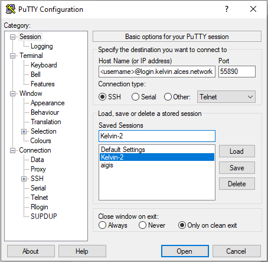
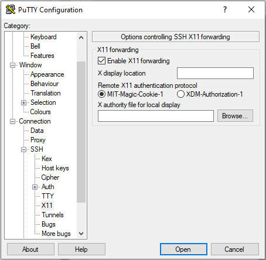
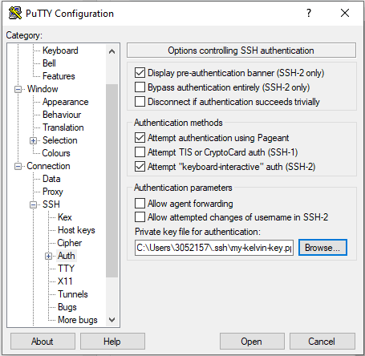

# Getting started

Here we will detail the first steps on accessing our HPC cluster, Kelvin2.

## Applying for an account

To gain an account to access Kelvin2, please fill the form found here : 

[https://www.ni-hpc.ac.uk/Access/](https://www.ni-hpc.ac.uk/Access/)

Please allow 48 hours for your account to be created.
Users will be emailed confirmation when their account has been proccessed.
 

## Credentials
### Username
- QUB - Username will be your student/staff number. 
- UU & EPSRC - Username will be the first letter of your first name, followed by your surname in lowercase e.g Joe Bloggs -> jbloggs

### Password
- QUB - Password will be that which is associated with QUB AD and QOL.
- UU & EPSRC - Password will be created when setting up remote access.
 

## Connecting to Kelvin2
Connection to Kelvin2 is via ssh. 
 
There are 2 ways to connect to Kelvin2: 
1. QUB network 
2. Remote access 

### QUB Network
 If you are within a QUB network you can connect to kelvin2 using your credentials and the following ssh command : 
 
    ssh <username>@kelvin2.qub.ac.uk 

### Remote Access

 Kelvin2 can be accessed from outside the QUB network by using SSH keys.  
 - Kelvin server name: login.kelvin.alces.network 
    - Port: 55890

<ins>Remote access from a Linux computer<ins> 

- Open a terminal and create a public/private key pair on the remote machine:

        ssh-keygen -t rsa –f ~/.ssh/my-kelvin-key

All users MUST set a password for the passphrase when prompted.

- Copy the public key generated to Kelvin2

The easiest way to do this is to place the  contents of the public key file into the authorized users file in your Kelvin2 home directory.

    cat ~/.ssh/my-kelvin-key.pub

Login to Kelvin2 and paste the above output into the end of the file:

     ~/.ssh/authorized_keys

Note: if you are away from the QUB campus and hence do not have access to Kelvin2,  send the public key via a method found [here](https://www.ni-hpc.ac.uk/contact/), whereupon an administrator will add it for you.

-	Login using SSH

        ssh –p 55890 –i ~/.ssh/my-kelvin-key <username>@login.kelvin.alces.network

<ins>Remote access from a Windows computer<ins> 

Two popular terminal emulators are putty and MobaXTerm. If using putty there is a tool called puttygen which will generate public/private keys. 

- Open a terminal and create a public/private key pair on the remote machine:

        ssh-keygen

Call your key `my-kelvin-key`. 
 All users MUST set a password for the passphrase when prompted.

- Copy the public key to Kelvin2. 

The easiest way to do this is to place the contents of the public key file into the authorized users file in your Kelvin2 home directory.

    type my-kelvin-key.pub

Login to Kelvin2 and paste the above output into the end of the file:

     ~/.ssh/authorized_keys
 
Note: if you are away from the QUB campus and hence do not have access to Kelvin2,  send the public key via a method found [here](https://www.ni-hpc.ac.uk/contact/), whereupon an administrator will add it for you.

-	Login using SSH

        ssh –p 55890 –i ~/.ssh/my-kelvin-key <username>@login.kelvin.alces.network

### SSH clients

For Windows users, the recommended way to connect to Kelvin-2 is via a ssh client. The two most popular options are MobaXTerm and PuTTy.

#### MobaXTerm

MobaXTerm is the recommended ssh client. It can be downloaded from the web  
[https://mobaxterm.mobatek.net](https://mobaxterm.mobatek.net){target=_blank}

To configure the remote session, firstly download and install MobaXTerm. Then, open it and follow the steps:

  1. On the initial screen, click on "Sessions".

      

  2. On the "Sessions" screen, click on "SSH".

    

  3. On the "SSH" screen, fill the following fields:

    - Remote host: "kelvin2.qub.ac.uk" from inside the QUB campus, or "login.kelvin.alces.network" from outside the QUB campus.
    - Tick "Specify username", and fill the box with your Kelvin-2 username.
    - Port: "22" from inside the QUB campus, or "55890" from outside the QUB campus.

    Click on "Advanced SSH Settings"

    

  4. On the "Advanced SSH Settings" screen, fill the following fields:

    - Tick "X11-Forwarding". This will allow to open graphical applications.
    - Only if you are connecting from ouside the QUB campus, tick "Use private key". Then click on the "paper sheet" icon on the right of the box, and select your private key file "my-kelvin-key".
    - Click the "OK" box on the bottom of the Window.

    The session will be stored for future use, and it will appear on the left part of the initial MobaXTerm window, under the tab "Sessions". To connect again, just click on the session.

    

#### PuTTy
 
PuTTy can be installed from the Microsoft store, or downloaded from the web :
[https://www.putty.org](https://www.putty.org){target=blank}

To use PuTTy as a remote ssh client, the configuration is similar to MobaXTerm. To begin, you will need to configure a session:

If you are connecting from outside the QUB campus, you must convert the private key "my-kelvin-key" to the PuTTy Private Key format ".ppk". To do so, you need to open the component "PuTTygen", and follow the steps

  1. Click on "Actions - Load an existing private key file - Load".

    

  2. When the browse window opens, change the file format from "PuTTy Private Key Files (*.ppk)" to "All files (*.*)". Then, browse in your system and select your private-key file "my-kelvin-key". You will be asked for the passphrase. 
Select "Save private key", and save it under the name "my-kelvin-key.ppk".

Now, you can configure your session in PuTTy, following the steps:

  1. On the initial window, fill the fields:

    - Host name (or IP address): "<username\>@kelvin2.qub.ac.uk" to connect from inside the QUB campus, or "<username\>@login.kelvin.alces.network" from outside the QUB campus.
    - Port: "22" to connect from inside the QUB campus, or "55890" from outside the QUB campus.
    - Connection type: click on "SSH".
    - Saved sessions: give a name to your session and click on "Save".

    

  2. Now click on the tab "Connection - SSH - X11". Tick on "Enable X11 forwarding", this will allow to open graphical applications.

    

  3. Only if you are connecting from outside the QUB campus, click on the tab "Connection - SSH - Auth". At the bottom, go to the box "Private key file for authentication", and click on "Browse". Select your private-key file "my-kelvin-key.ppk".

    

  4. Go back to the tab "Session" and save the created session, it will appear in the big box. To connect, select your session from the box, and click on "Open" at the bottom of the window.

## Copying data to Kelvin2
To copy files across to kelvin use pscp or scp. Give the full path to the directory/file to be copied and connect using your credentials, like below: 

<ins>Windows OS with putty installed<ins> 

    pscp –p 55890 "C:\Users\MyPC\Documents\test.txt" -i my_kelvin_key <username>@login.kelvin.alces.network

<ins>Linux OS:<ins> 

Attention that the "-P" flag to specify the ssh port must be in capital

    scp –P 55890 -i ~/.ssh/my_kelvin_key ~/test.txt <username>@login.kelvin.alces.network:~

### Windows scp clients
In Windows machines, MobaXTerm and WinSCP can be used to transfer files from and to Kelvin-2 in a graphical easy way. Already saved sessions of MobaXTerm or PuTTy can be used.

- MobaXTerm:   
[https://mobaxterm.mobatek.net](https://mobaxterm.mobatek.net)

- WinSCP:  
[https://winscp.net/eng/index.php](https://winscp.net/eng/index.php)

